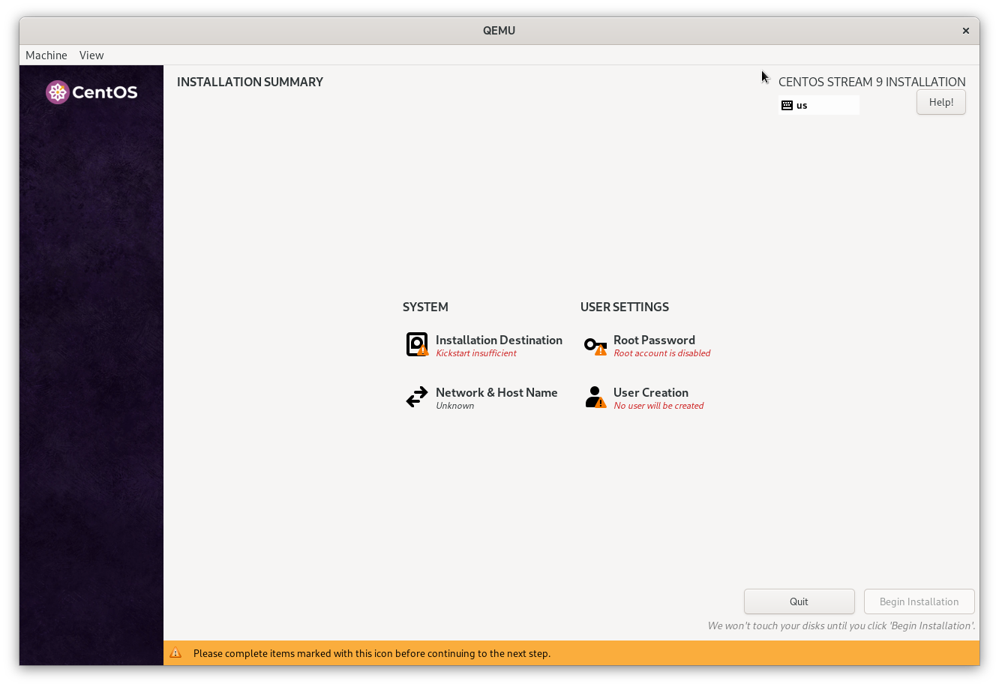

A question popped up today on the #bootc:fedoraproject.org Matrix channel on
how to create an interactive installer for a [bootable container](https://containers.github.io/bootc/).
This is a quick write up of how to use some details in [bootc-image-builder](https://github.com/osbuild/bootc-image-builder)
to generate an interactive [Anaconda](https://docs.fedoraproject.org/en-US/quick-docs/anaconda-introduction/)
ISO.

You can provide [custom kickstarts](https://github.com/osbuild/bootc-image-builder?tab=readme-ov-file#anaconda-iso-installer-options-installer-mapping) in `bootc-image-builder`. The README
mentions that:

*Note that bootc-image-builder will automatically add the command that installs the container image (`ostreecontainer` ...), so this line or any line that conflicts with it should not be included. See the relevant Kickstart documentation for more information. No other kickstart commands are added by bootc-image-builder in this case, so it is the responsibility of the user to provide all other commands (for example, for partitioning, network, language, etc).*

This implies that if we provide an empty custom kickstart we will end up with
an incomplete kickstart containing only the `ostreecontainer` directive:

```toml
# see https://github.com/osbuild/bootc-image-builder?tab=readme-ov-file#anaconda-iso-installer-options-installer-mapping
[customizations.installer.kickstart]
contents = ""
```

And then build an ISO:

```
sudo podman run \
    --rm \
    -it \
    --privileged \
    --pull=newer \
    --security-opt label=type:unconfined_t \
    -v $(pwd)/config.toml:/config.toml:ro \
    -v $(pwd)/output:/output \
    quay.io/centos-bootc/bootc-image-builder:latest \
    --type anaconda-iso \
    quay.io/centos-bootc/centos-bootc:stream9
```

This will put Anaconda into interactive mode so the user can provide the missing
information. You can also enable [extra modules](https://github.com/osbuild/bootc-image-builder?tab=readme-ov-file#anaconda-iso-installer-modules) for Anaconda though I haven't
tried so myself.



Note that you will need to create partitions and label `/boot` as
`boot` so the installed system can find its boot partition. 
